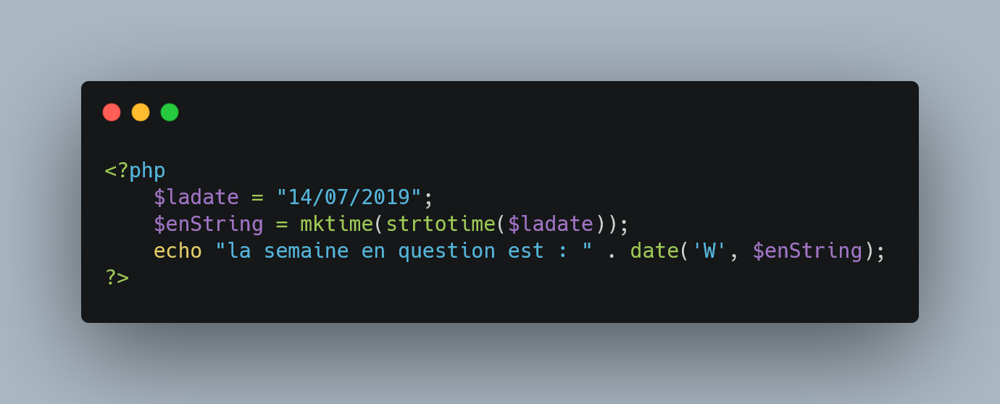
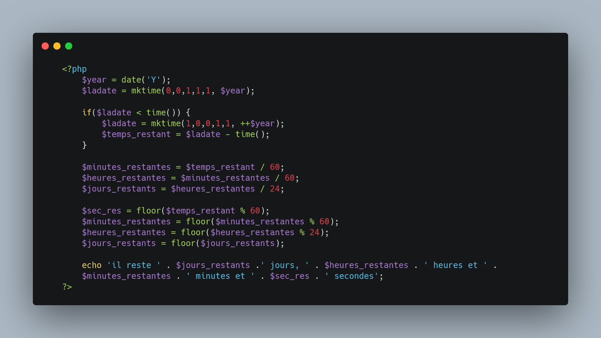
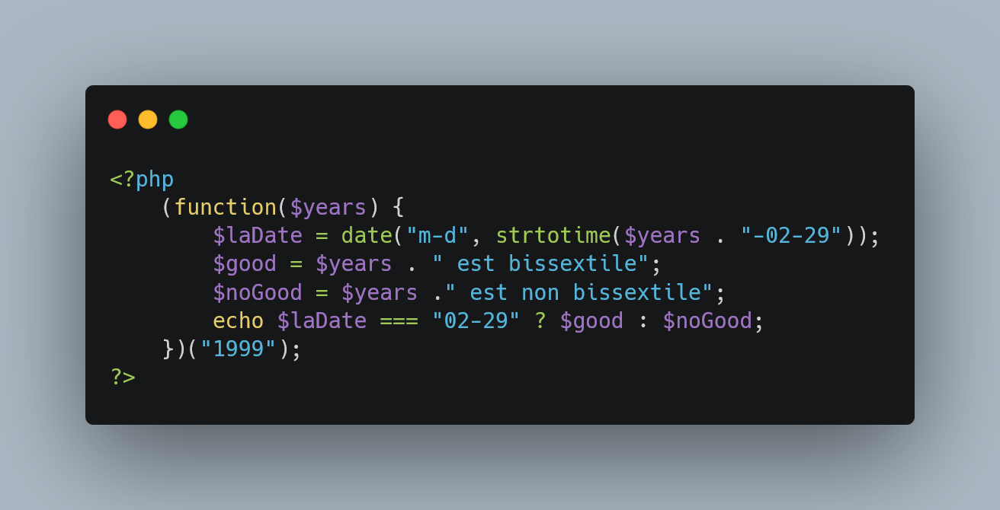
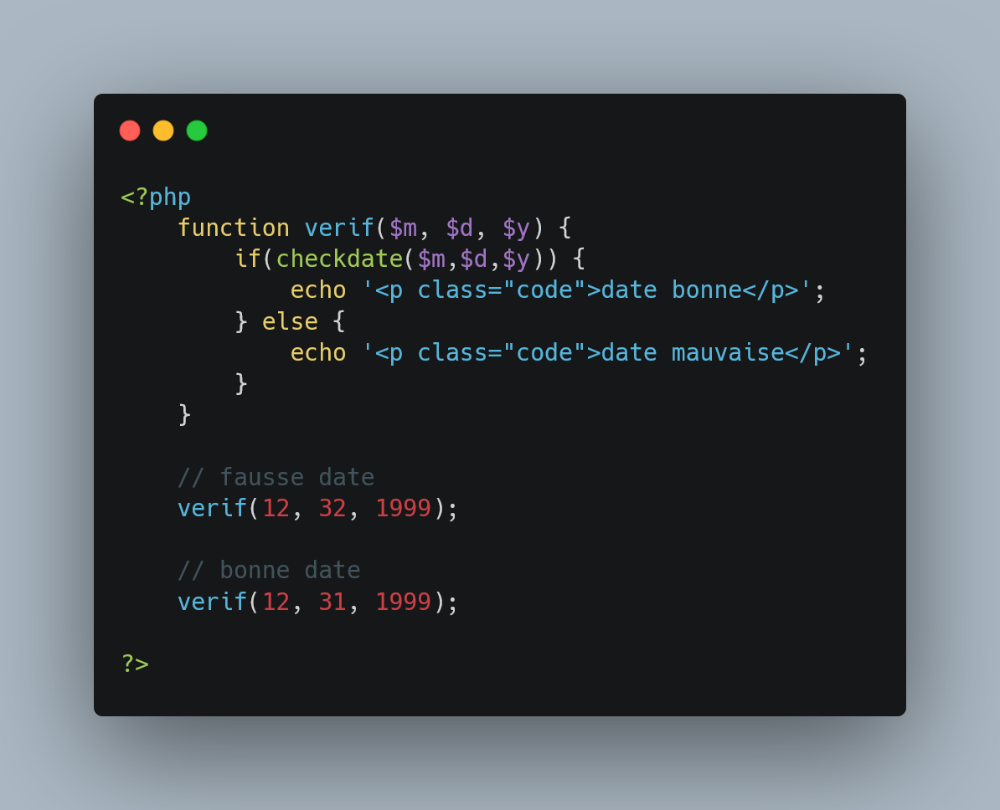
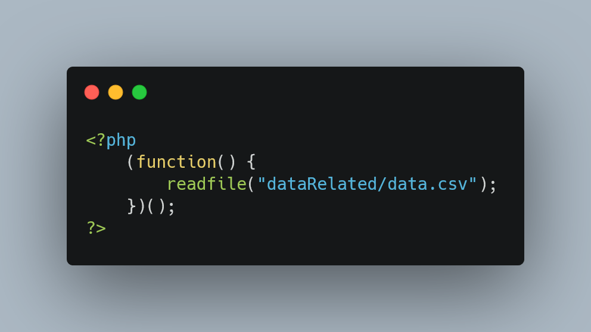
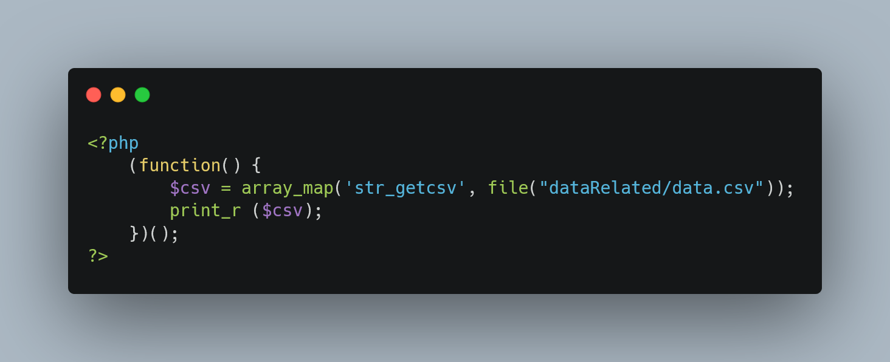
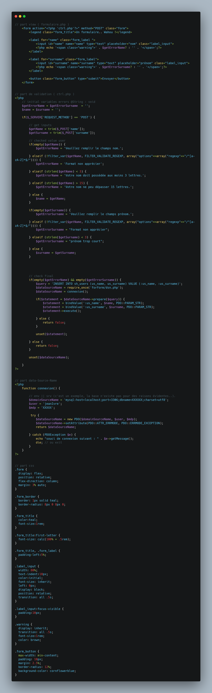

# Exo Php : procédural

+  [Super Global](#supGlo)
+ [Nombre impair](#ni)
+ [500 fois une phrase](#re)
+ [table de multiplication](#tm)
+ [tableau](#ta)
+ [Les fonctions | un lien](#fl)
+ [Les fonctions | sum( )](#fs)
+ [Les fonctions | password](#fp)
+ [Les Dates | semaine](#ds)
+ [Les Dates | cooldown](#dc)
+  [Les Dates | bissextile](#dx)
+  [Les Dates | validation](#dv)
+  [Les Fichiers | lire un fichier](#fr)
+  [Les Fichiers | pretty csv](#fp)
+  [Formulaire | Envoie de donnée](#form)

## <a id="supGlo">Super Global</a> :

_____

## <a id="ni">Nombre Impair :</a>

_____

## <a id="re">500 fois une phrase :</a>

_____

## <a id="tm">table de multiplication :</a>

_____

## <a id="ta">tableau :</a>

Tout les exercices lier à cette partie ne sont pas indiqué, le cas avec ksort entre autre.

_____

## <a id="fl">Les fonctions | un lien :</a>

_____

## <a id="fs">Les fonctions | sum(  )</a>

_____

## <a id="fp">Les fonctions | password</a>

_____

## <a id="ds">Les Dates | Semaine</a>

_____

## <a id="dc">Les Dates | cooldown</a>

_____

## <a id="dx">Les Dates | années bissextile</a>

_____

## <a id="dv">Les Dates | check validitée date</a>

_____

## <a id="fr">Les Fichiers | Lire un fichier</a>

_____

## <a id="fp">Les Fichiers |  pretty ( )</a>

_____

## <a id="form">Formulaire | Envoie de donnée</a>

