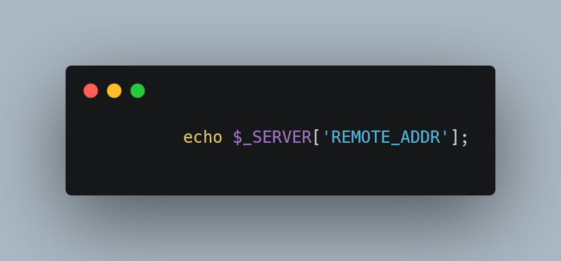
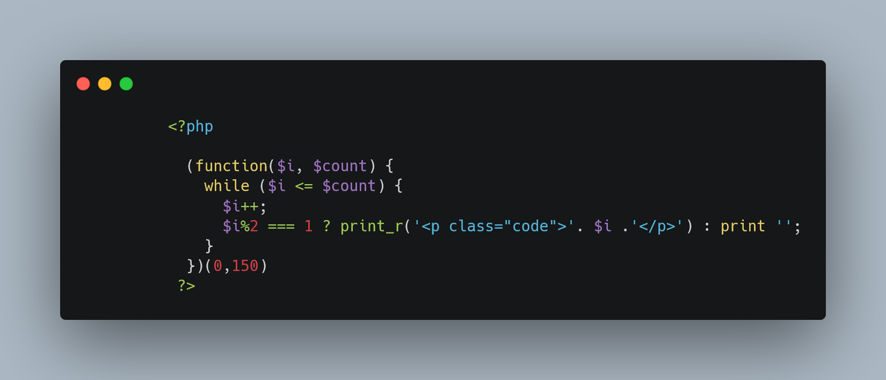
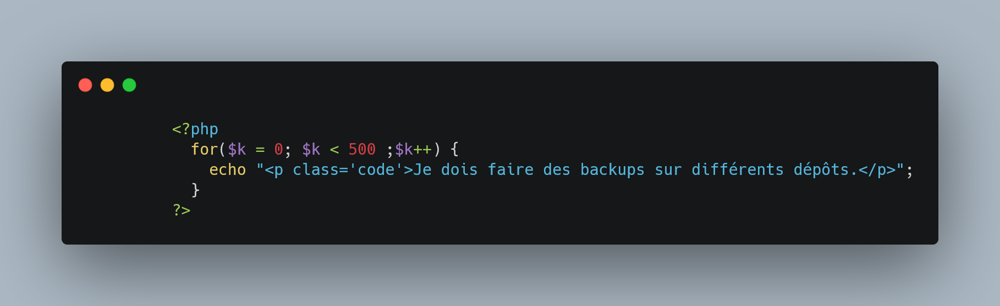
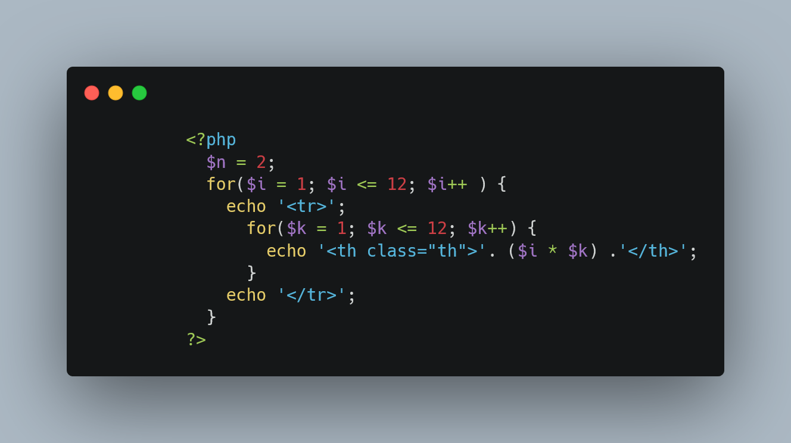
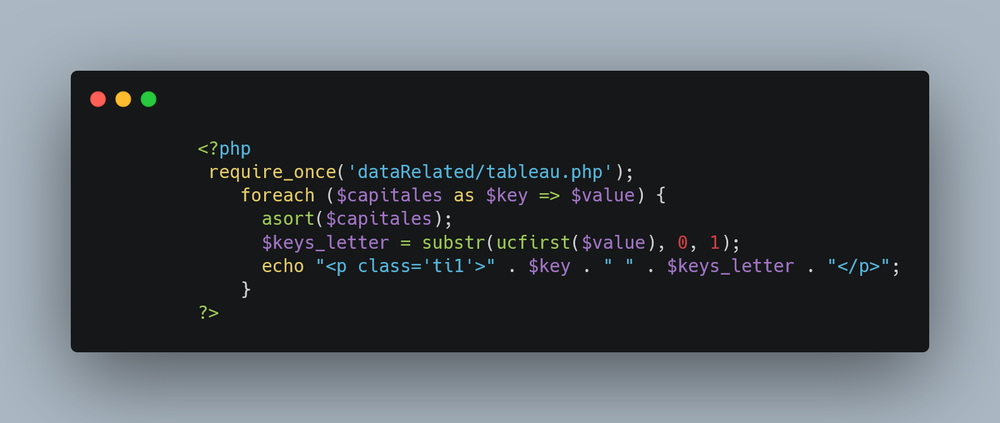
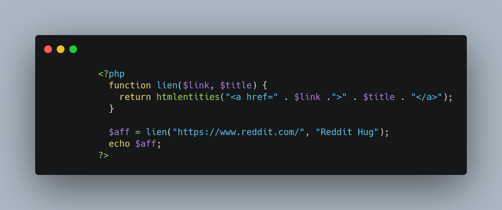
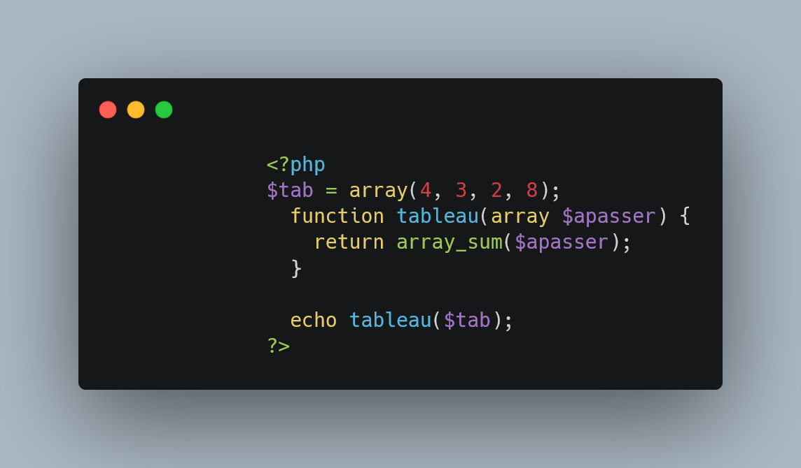
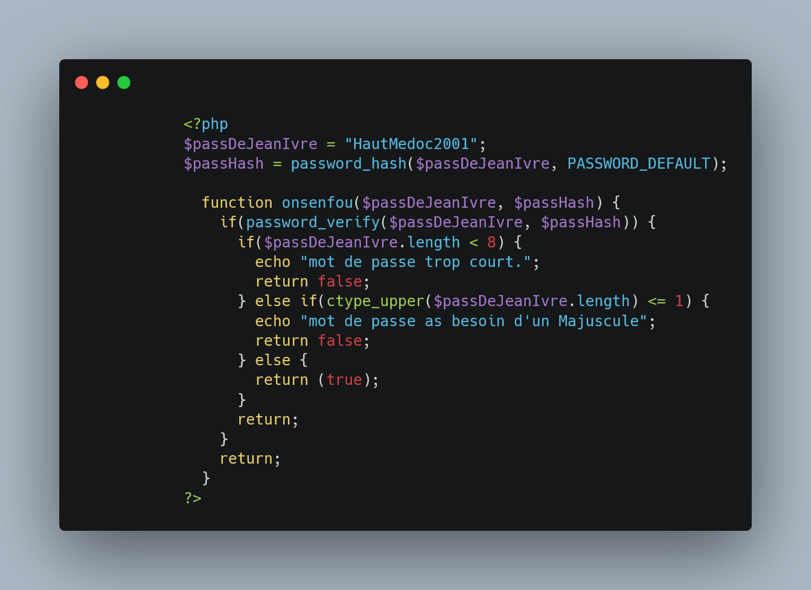

# Exo Php : procédural

+  [Super Global](#supGlo)
+ [Nombre impair](#ni)
+ [500 fois une phrase](#re)
+ [table de multiplication](#tm)
+ [tableau](#ta)
+ [Les fonctions | un lien](#fl)
+ [Les fonctions | sum( )](#fs)
+ [Les fonctions | password](#fp)

## <a id="supGlo">Super Global</a> :

_____

## <a id="ni">Nombre Impair :</a>

_____

## <a id="re">500 fois une phrase :</a>

_____

## <a id="tm">table de multiplication :</a>

_____

## <a id="ta">tableau :</a>

Tout les exercices lier à cette partie ne sont pas indiqué, le cas avec ksort entre autre.

_____

## <a id="fl">Les fonctions | un lien :</a>

_____

## <a id="fs">Les fonctions | sum(  )</a>

_____

## <a id="fp">Les fonctions | password</a>

